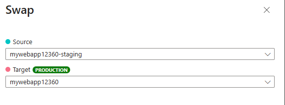

---
lab:
  topic: Azure App Service
  title: Alterne slots de implantação do Serviço de Aplicativo do Azure
  description: 'Aprenda a alternar slots de implantação no Serviço de Aplicativo do Azure. Neste exercício, você: implanta um aplicativo simples no Serviço de Aplicativo; faz uma pequena alteração no aplicativo e a implanta em um slot de preparo. Por último, troca os slots para que o aplicativo atualizado entre em produção.'
---

# Alterne slots de implantação do Serviço de Aplicativo do Azure

Neste exercício, você implantará um site HTML estático no Serviço de Aplicativo do Azure, criará um slot de implantação de preparo, fará alterações ao código e as implantará no slot de preparo e trocará os slots de preparo e produção para promover as alterações na produção. Você aprenderá a usar slots de implantação para atualizações seguras de aplicativos e implantações azul-verde.

Tarefas realizadas neste exercício:

* Baixar e implantar o aplicativo de exemplo no Serviço de Aplicativo do Azure.
* Crie um slot de implantação de preparo.
* Faça uma alteração no aplicativo de exemplo e implante-o no slot de preparo.
* Troque os slots de preparo e produção padrão para mover as alterações para o slot de produção.

Este exercício levará aproximadamente **30** minutos para ser concluído.

## Baixar e executar o aplicativo de amostra

Nesta seção, você baixará o aplicativo de exemplo e definirá variáveis para facilitar a inserção dos comandos e, em seguida, criará um recurso do Serviço de Aplicativo do Azure e implantará um site HTML estático usando comandos da CLI do Azure.

1. No navegador, vá par o portal do Azure [https://portal.azure.com](https://portal.azure.com). Faça login com suas credenciais do Azure se for solicitado.

1. Use o botão **[\>_]** à direita da barra de pesquisa na parte superior da página para criar um novo Cloud Shell no portal do Azure, selecionando um ambiente do ***Bash***. O Cloud Shell fornece uma interface de linha de comando em um painel na parte inferior do portal do Azure. Se você for solicitado a selecionar uma conta de armazenamento na qual manter seus arquivos, selecione **Nenhuma conta de armazenamento necessária**, sua assinatura e **Aplicar**.

    > **Observação**: se você já criou uma Cloud Shell que usa um ambiente *PowerShell*, troque-o pelo ***Bash***.

1. Na barra de ferramentas do Cloud Shell, no menu **Configurações**, selecione **Ir para a versão clássica** (isso é necessário para usar o editor de código).

1. Execute o seguinte comando **git** para clonar o repositório de exemplo.

    ```bash
    git clone https://github.com/Azure-Samples/html-docs-hello-world.git
    ```

1. Defina variáveis para manter o grupo de recursos e os nomes dos aplicativos executando os comandos a seguir. Você pode substituir o valor **rg-mywebapp** para **resourceGroup** se tiver um grupo de recursos que deseja usar. Anote o valor do **appName** que é exibido após a execução dos comandos. Você vai precisar dele mais adiante neste exercício.

    ```bash
    resourceGroup=rg-mywebapp

    appName=mywebapp$RANDOM
    echo $appName
    ```

1. Vá para o diretório que contém o código de exemplo e execute o comando **az webapp up**. **Observação:** Esse comando pode levar alguns minutos para ser executado.

    ```bash
    cd html-docs-hello-world

    az webapp up -g $resourceGroup -n $appName --sku P0V3 --html
    ```

    Agora que a sua implantação foi concluída, é hora de exibir o aplicativo Web.

1. No portal do Azure, navegue até o aplicativo Web que você implantou. Você pode inserir o nome anotado anteriormente na barra de pesquisa **Pesquisar recursos, serviços e documentos (G + /)** e selecionar o recurso na lista.

1. Selecione o link para seu aplicativo Web localizado no campo **Domínio padrão** na seção **Essentials**. O link abrirá o site em uma nova guia.

## Implante o código atualizado em um slot de implantação

Nesta seção, você cria um slot de implantação, modifica o HTML no aplicativo e implanta o código atualizado no novo slot de implantação.

### Criar um slot de implantação 

1. Retorne à guia com o portal do Azure e o Cloud Shell.

1. Insira o seguinte comando no Cloud Shell para criar um slot de implantação chamado *staging*.

    ```bash
    az webapp deployment slot create -n $appName -g $resourceGroup --slot staging
    ```

1. Aguarde a conclusão do comando e selecione **Implantação > Slots de implantação** no menu à esquerda para exibir os slots de implantação do seu aplicativo Web. Observe que o nome do novo slot contém *-staging* anexado ao nome do seu aplicativo Web

### Atualize o código e implante no slot de preparo

1. No Cloud Shell, digite **code index.html** para abrir o editor. Localize a marca de título **\<h1\>** e altere *Serviço de Aplicativo do Azure – Site HTML estático de exemplo* para *Slot de Preparo do Serviço de Aplicativo do Azure* ou qualquer outra coisa que você gostaria.

1. Use os comandos **ctrl-s** para salvar e **ctrl-q** para sair.

1. No Cloud Shell, execute o seguinte comando para criar um arquivo zip do projeto atualizado. Um arquivo zip ou recurso de aplicativo da Web (WAR) é necessário para a próxima etapa.

    ```bash
    zip -r stagingcode.zip .
    ```

1. Execute o seguinte comando no Cloud Shell para implantar suas atualizações no slot de preparo.

    ```bash
    az webapp deploy -g $resourceGroup -n $appName --src-path ./stagingcode.zip --slot staging
    ```

1. Selecione **Implantação > Slots de implantação** no menu à esquerda do aplicativo Web e, em seguida, selecione o slot de preparo criado anteriormente.

1. Selecione o link no campo **Domínio padrão** na seção **Essentials**. O link abrirá o site para o slot de preparo em uma nova guia.

## Troque os slots de preparo e de produção

Você pode executar uma troca no portal do Azure com a opção **Trocar** na barra de ferramentas. A opção **Trocar** aparecerá na barra de ferramentas se você selecionar **Visão Geral** ou **Implantação > Slots de implantação** no menu à esquerda do aplicativo Web.

1. No portal do Azure, selecione **Trocar** na barra de ferramentas para abrir o painel **Trocar**.

1. Revise as configurações no painel de troca. A **Origem** deve mostrar o slot **-staging**, e o **Destino** deve mostrar o slot de produção padrão.

    

1. Selecione **Iniciar troca** e aguarde a conclusão da operação. Você pode acompanhar a conclusão no painel **Notificações**, que pode ser aberto selecionando-se o ícone de sino na parte superior do portal.

1. Para verificar a troca, navegue até o aplicativo Web que você implantou. Insira o nome do aplicativo Web que você criou anteriormente (por exemplo, *mywebapp12360*) na **barra de pesquisa Pesquisar recursos, serviços e documentos (G + /)** e selecione o recurso na lista.

1. Selecione o link para seu aplicativo Web localizado no campo **Domínio padrão** na seção **Essentials**. O link abrirá o site (slot de produção) em uma nova guia.

1. Verifique as suas alterações, talvez seja necessário atualizar a página para que elas apareçam.

## Limpar os recursos

Agora que você concluiu o exercício, exclua os recursos de nuvem que criou para evitar uso desnecessário de recursos.

1. No navegador, vá par o portal do Azure [https://portal.azure.com](https://portal.azure.com). Faça login com suas credenciais do Azure se for solicitado.
1. Navegue até o grupo de recursos que você criou e exiba o conteúdo dos recursos usados neste exercício.
1. Na barra de ferramentas, selecione **Excluir grupo de recursos**.
1. Insira o nome do grupo de recursos e confirme que deseja excluí-lo.

> **CUIDADO:** excluir o grupo de recursos excluirá todos os recursos que ele contém. Se você escolher um grupo de recursos para este exercício, todos os recursos fora do escopo deste exercício também serão excluídos.
