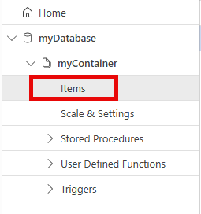

---
lab:
  topic: Azure Cosmos DB
  title: Criar recursos no Azure Cosmos DB for NoSQL usando o .NET
  description: Saiba como criar recursos de banco de dados e contêineres no Azure Cosmos DB com o SDK do Microsoft .NET v3.
---

# Criar recursos no Azure Cosmos DB for NoSQL usando o .NET

Neste exercício, você criará uma conta Azure Cosmos DB e um aplicativo de console .NET que usa o SDK do Microsoft Azure Cosmos DB para criar um banco de dados, um contêiner e um item de exemplo. Você aprenderá a configurar a autenticação, executar operações de banco de dados programaticamente e verificar os resultados no portal do Azure.

Tarefas executadas neste exercício:

* Criar uma conta do Azure Cosmos DB
* Criar um aplicativo de console que cria um banco de dados, um contêiner e um item
* Executar o aplicativo de console e verificar os resultados

Este exercício levará aproximadamente **30** minutos para ser concluído.

## Criar uma conta do Azure Cosmos DB

Nesta seção do exercício, você cria um grupo de recursos e uma conta do Azure Cosmos DB. Você também registra o ponto de extremidade e a chave de acesso da conta.

1. No navegador, vá par o portal do Azure [https://portal.azure.com](https://portal.azure.com). Faça login com suas credenciais do Azure se for solicitado.

1. Use o botão **[\>_]** à direita da barra de pesquisa na parte superior da página para criar um novo Cloud Shell no portal do Azure, selecionando um ambiente do ***Bash***. O Cloud Shell fornece uma interface de linha de comando em um painel na parte inferior do portal do Azure. Se você for solicitado a selecionar uma conta de armazenamento na qual manter seus arquivos, selecione **Nenhuma conta de armazenamento necessária**, sua assinatura e **Aplicar**.

    > **Observação**: se você já criou uma Cloud Shell que usa um ambiente *PowerShell*, troque-o pelo ***Bash***.

1. Na barra de ferramentas do Cloud Shell, no menu **Configurações**, selecione **Ir para a versão clássica** (isso é necessário para usar o editor de código).

1. Crie um grupo de recursos para os recursos que este exercício requer. Se você já tiver um grupo de recursos que deseja usar, vá para a próxima etapa. Substitua **myResourceGroup** por um nome que você quer usar para o grupo de recursos. Você pode substituir **eastus** por uma região perto de você, se necessário.

    ```
    az group create --location eastus --name myResourceGroup
    ```

1. Muitos comandos exigem nomes exclusivos e usam os mesmos parâmetros. Criar algumas variáveis reduzirá as alterações necessárias para os comandos que criam recursos. Execute os comandos a seguir para criar as variáveis necessárias. Substitua **myResourceGroup** pelo nome que você está usando para este exercício.

    ```
    resourceGroup=myResourceGroup
    accountName=cosmosexercise$RANDOM
    ```

1. Execute os comandos a seguir para criar a conta do Azure Cosmos DB. Cada nome de conta deve ser exclusivo. 

    ```
    az cosmosdb create --name $accountName \
        --resource-group $resourceGroup
    ```

1.  Execute o seguinte comando para recuperar o **documentEndpoint** para a conta do Azure Cosmos DB. Registre o ponto de extremidade dos resultados do comando. Ele será necessário no exercício.

    ```
    az cosmosdb show --name $accountName \
        --resource-group $resourceGroup \
        --query "documentEndpoint" --output tsv
    ```

1. Recupere a chave primária da conta com o comando a seguir. Registre a chave primária dos resultados do comando. Ela será necessária posteriormente no exercício.

    ```
    az cosmosdb keys list --name $accountName \
        --resource-group $resourceGroup \
        --query "primaryMasterKey" --output tsv
    ```

## Criar recursos de dados e um item com um aplicativo de console .NET

Agora que os recursos necessários estão implantados no Azure, a próxima etapa é configurar o aplicativo de console. As etapas a seguir são executadas no Cloud Shell.

>**Dica:** redimensione o Cloud Shell para exibir mais informações e código arrastando a borda superior. Você também pode usar os botões minimizar e maximizar para alternar entre o Cloud Shell e a interface do portal principal.

1. Crie uma pasta para o projeto e acesse-a.

    ```bash
    mkdir cosmosdb
    cd cosmosdb
    ```

1. Crie o aplicativo de console .NET.

    ```bash
    dotnet new console
    ```

### Configurar o aplicativo de console

1. Execute os comandos a seguir para adicionar os pacotes **Microsoft.Azure.Cosmos**, **Newtonsoft.Json** e **dotenv.net** ao projeto.

    ```bash
    dotnet add package Microsoft.Azure.Cosmos --version 3.*
    dotnet add package Newtonsoft.Json --version 13.*
    dotnet add package dotenv.net
    ```

1. Execute o comando a seguir para criar o arquivo **.env** para manter os segredos e, em seguida, abra-o no editor de código.

    ```bash
    touch .env
    code .env
    ```

1. Adicione o código a seguir ao arquivo **.env**. Substitua **YOUR_DOCUMENT_ENDPOINT** e **YOUR_ACCOUNT_KEY** os valores registrados antes.

    ```
    DOCUMENT_ENDPOINT="YOUR_DOCUMENT_ENDPOINT"
    ACCOUNT_KEY="YOUR_ACCOUNT_KEY"
    ```

1. Pressione **ctrl+s** para salvar o arquivo e **ctrl+q** para sair do editor.

Agora, é hora de substituir o código do modelo no arquivo **Program.cs** usando o editor no Cloud Shell.

### Adicione o código inicial ao projeto

1. Execute o seguinte comando no Cloud Shell para começar a editar o aplicativo.

    ```bash
    code Program.cs
    ```

1. Substitua qualquer código existente pelo seguinte snippet de código. 

    O código apresenta a estrutura geral do aplicativo. Examine os comentários no código para entender como ele funciona. Para concluir o aplicativo, adicione código em áreas especificadas mais adiante no exercício. 

    ```csharp
    using Microsoft.Azure.Cosmos;
    using dotenv.net;
    
    string databaseName = "myDatabase"; // Name of the database to create or use
    string containerName = "myContainer"; // Name of the container to create or use
    
    // Load environment variables from .env file
    DotEnv.Load();
    var envVars = DotEnv.Read();
    string cosmosDbAccountUrl = envVars["DOCUMENT_ENDPOINT"];
    string accountKey = envVars["ACCOUNT_KEY"];
    
    if (string.IsNullOrEmpty(cosmosDbAccountUrl) || string.IsNullOrEmpty(accountKey))
    {
        Console.WriteLine("Please set the DOCUMENT_ENDPOINT and ACCOUNT_KEY environment variables.");
        return;
    }
    
    // CREATE THE COSMOS DB CLIENT USING THE ACCOUNT URL AND KEY
    
    
    try
    {
        // CREATE A DATABASE IF IT DOESN'T ALREADY EXIST
    
    
        // CREATE A CONTAINER WITH A SPECIFIED PARTITION KEY
    
    
        // DEFINE A TYPED ITEM (PRODUCT) TO ADD TO THE CONTAINER
    
    
        // ADD THE ITEM TO THE CONTAINER
    
    
    }
    catch (CosmosException ex)
    {
        // Handle Cosmos DB-specific exceptions
        // Log the status code and error message for debugging
        Console.WriteLine($"Cosmos DB Error: {ex.StatusCode} - {ex.Message}");
    }
    catch (Exception ex)
    {
        // Handle general exceptions
        // Log the error message for debugging
        Console.WriteLine($"Error: {ex.Message}");
    }
    
    // This class represents a product in the Cosmos DB container
    public class Product
    {
        public string? id { get; set; }
        public string? name { get; set; }
        public string? description { get; set; }
    }
    ```

Em seguida, adicione código em áreas especificadas dos projetos para criar o cliente, o banco de dados e o contêiner e adicione um item de exemplo ao contêiner.

### Adicione código para criar o cliente e executar operações 

1. Adicione o seguinte código no espaço após o comentário **// CRIAR O CLIENTE DO COSMOS DB USANDO O URL E A CHAVE DA CONTA**. Esse código define o cliente usado para se conectar à sua conta do Azure Cosmos DB.

    ```csharp
    CosmosClient client = new(
        accountEndpoint: cosmosDbAccountUrl,
        authKeyOrResourceToken: accountKey
    );
    ```

    >Observação: é uma prática recomendada usar a **DefaultAzureCredential** da biblioteca do *Azure Identity*. Isso pode exigir alguns requisitos de configuração adicionais no Azure, dependendo de como a sua assinatura está configurada. 

1. Adicione o seguinte código no espaço após o comentário **// CRIAR UM BANCO DE DADOS SE AINDA NÃO EXISTIR UM**. 

    ```csharp
    Database database = await client.CreateDatabaseIfNotExistsAsync(databaseName);
    Console.WriteLine($"Created or retrieved database: {database.Id}");
    ```

1. Adicione o seguinte código no espaço após o comentário **// CRIAR UM CONTÊINER COM UM CHAVE DE PARTICIPAÇÃO ESPECIFICADA**. 

    ```csharp
    Container container = await database.CreateContainerIfNotExistsAsync(
        id: containerName,
        partitionKeyPath: "/id"
    );
    Console.WriteLine($"Created or retrieved container: {container.Id}");
    ```

1. Adicione o seguinte código no espaço após o comentário **// DEFINIR UM ITEM TIPADO (PRODUTO) PARA ADICIONAR AO CONTÊINER**. Isso define o item que será adicionado ao contêiner.

    ```csharp
    Product newItem = new Product
    {
        id = Guid.NewGuid().ToString(), // Generate a unique ID for the product
        name = "Sample Item",
        description = "This is a sample item in my Azure Cosmos DB exercise."
    };
    ```

1. Adicione o seguinte código no espaço após o comentário **// ADICIONAR O ITEM AO CONTÊINER**. 

    ```csharp
    ItemResponse<Product> createResponse = await container.CreateItemAsync(
        item: newItem,
        partitionKey: new PartitionKey(newItem.id)
    );

    Console.WriteLine($"Created item with ID: {createResponse.Resource.id}");
    Console.WriteLine($"Request charge: {createResponse.RequestCharge} RUs");
    ```

1. Agora que o código está completo, salve o seu progresso. Use **ctrl + s** para salvar o arquivo e **ctrl + q** para sair do editor.

1. Execute o comando a seguir no Cloud Shell para testar se há erros no projeto. Se houver erros, abra o arquivo *Program.cs* no editor e verifique se há código ausente ou erros de colagem.

    ```
    dotnet build
    ```

Agora que o projeto foi concluído, é hora de executar o aplicativo e verificar os resultados no portal do Azure.

## Execute o aplicativo e verifique os resultados

1. Execute o `dotnet run` comando no Cloud Shell. O resultado deve ser algo semelhante ao seguinte exemplo.

    ```
    Created or retrieved database: myDatabase
    Created or retrieved container: myContainer
    Created item: c549c3fa-054d-40db-a42b-c05deabbc4a6
    Request charge: 6.29 RUs
    ```

1. No portal do Azure, navegue até o recurso do Azure Cosmos DB que você criou antes. Selecione **Data Explorer** no painel de navegação esquerdo. No **Data Explorer**, selecione **myDatabase** e expanda **myContainer**. Você pode exibir o item que criou selecionando **Itens**.

    

## Limpar os recursos

Agora que você concluiu o exercício, exclua os recursos de nuvem que criou para evitar uso desnecessário de recursos.

1. No navegador, vá par o portal do Azure [https://portal.azure.com](https://portal.azure.com). Faça login com suas credenciais do Azure se for solicitado.
1. Navegue até o grupo de recursos que você criou e exiba o conteúdo dos recursos usados neste exercício.
1. Na barra de ferramentas, selecione **Excluir grupo de recursos**.
1. Insira o nome do grupo de recursos e confirme que deseja excluí-lo.

> **CUIDADO:** excluir o grupo de recursos excluirá todos os recursos que ele contém. Se você escolher um grupo de recursos para este exercício, todos os recursos fora do escopo deste exercício também serão excluídos.
